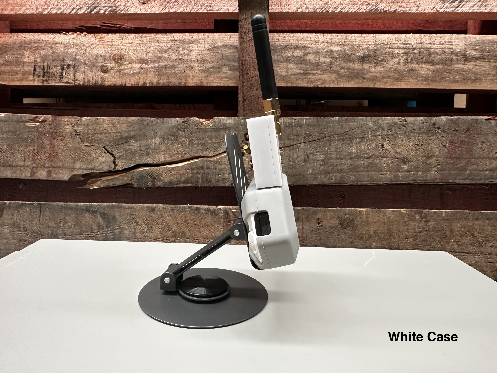

# 3in1 WiFi MultiBoard
Update: 27 Feb 2025 by John @ Honey Honey Team

 

## What is it, and what can the Multiboard do??

The 3-in-1 Multiboard contains three chipsets: ESP32, nRF24, and CC1101. 

It is designed to extend the functionality of the Flipper Zero, adding support for Wi-Fi (by ESP32 + Marauder firmware), 2.4GHz RF (by nRF24), and expanded SubGHz coverage (by CC1101).

 

## Specification of the Multiboard

- ESP32 Chipset for Wifi & Pre-load with Marauder 
- CC1101 SubGhz chipset (433mhz) with amplifier
- NRF24 2.4Ghz Chipset
- Compact design, with 2 * SMA interchangeable antennas.  
- Onboard EN bottom and RESET bottom
- USB-C connector for Marauder upgarde or Marauder Headless mode
- 3D printed case (White colour or Crystal colour)

 

  
## How the Multiboard operate 

- Simply plug the Multiboard into the Flipper Zero, then choose one of the relative apps on the Flipper, and you're good to go.
- The nRF24 and CC1101 chipsets do not require additional firmware to function. Most Flipper Zero firmware, including Momentum, Unleashed, and others, support them natively.
- The ESP32 requires Marauder firmware to function, and it comes pre-loaded with the firmware on the ESP32 chipset.
- There is NO physical switch for switching functionalities between NRF24 / ESP32 / CC1101 chipsets. The switching function has been automated based on what app is used on Flipper Zero. 

 

## How to upgrade Marauder firmware

 Click the Triangle for more details   

 

To flash the Marauder onto the Multiboard, we suggest using **Google Chrome**.  

1. Open the Web Flasher called < FzeeFlasher > [https://fzeeflasher.com/](https://fzeeflasher.com). 

2. Connect the 3-in-1 board to the PC/Mac using a USB-C cable. Ensure the cable has data transfer capability. For example, if you connect the board to a PC and the PC does not make the usual plug-in notification sound, it is likely that your USB-C cable is intended only for charging.

3. On https://fzeeflasher.com/, go to [Connect]. In the pop-up window, select [USB Serial (ComXxX) - Paired], which usually has only one serial for most users. Then, click [Connect].

4. If everything is working correctly, the website should allow you to select the model of the board. Choose [ESP32-S2] under the KOKO Marauder section. Then, select your preferred [Version] of Marauder and choose [Marauder] under [Firmware].
   
5. Then the website should allow you to hit [ PROGRAM ] bottom.
    
6. In a minute then you are golden. 

FYI. 

- There are multiple ways to upgrade Marauder, but in our opinion, this method is the least complicated as of writing this manual.

 

## How to use headless mode aka command line of the Marauder

 Click the Triangle for more details   

 

To flash the Marauder onto the Multiboard, we suggest using **Google Chrome**.  

The board supports headless mode, also known as command line (CLI). To simplify the process, we will continue to use [https://fzeeflasher.com/](https://fzeeflasher.com) as the demo platform. Here is how:

1. Open [https://fzeeflasher.com/](https://fzeeflasher.com) in Google Chrome, select [ Serial Terminal ], then [ Connect ]. In the pop-up window, choose [ USB Serial [ComXX] - Paired ], then click [ Connect ]

2. Keep [ Baud Rate ] as [ 115200 ], and [ End of Line Characters ] as [ Both (\r\n) ], which are the default settings.

3. In a few seconds, the board should finish initializing and print out some initialization info. When you see the [ > ] at the end of the printout, the command line is ready to go.
   
5. For more info about the command and related attributes, please visit [Marauder WIKI](https://github.com/justcallmekoko/ESP32Marauder/wiki/cli).
   

FYI. 

- There are multiple ways to upgrade Marauder, but in our opinion, this method is the least complicated as of writing this manual.

 

## Our official shop if you would like to support us.  
1. [Our official site](https://honeyhoneylab.com/)
2. [Tindie](https://www.tindie.com/stores/honeyhoneytrading/)
3. [eBay](https://www.ebay.com.au/itm/197058578110)
4. ~~[ETSY Shop](https://www.etsy.com/au/shop/HoneyHoneyTrading)~~

 

## Warrenty and Tech Support

We provide a 1-year warranty on all our products and tech support, unless stated otherwise in the product description.

FYI, our [Etsy](https://www.etsy.com/au/shop/HoneyHoneyTrading) shop is no longer in operation. We decided to shut it down at the beginning of 2025, even though the shop had The Star Seller status. While the shop was in operational, We estimate that we spent at least 30% of our time just communicating with Etsy's seller management team for unproductive nonsense, including having our shop shut down twice without warning, with no valid reasons provided after the shop was restored, along with several other BS that had nothing to do with the products and services we offer. 

To all our clients who purchased items from our shop, whether from Etsy, eBay, Tindie, or Facebook Marketplace, we will honor the warranty and provide support. Please feel free to email us at Support@honeyhoneylab.com. or [Whatsapp](https://wa.me/61452559581) 

 

## Credibility
- Credit of the [web flasher](https://fzeeflasher.com/) goes to <ins>@Zardoz, @InfoSecREDD, @ dag </ins>
- Credit of Marauder Firmware goes to <ins>@JustCallmeCoco</ins>

 

## FAQ 

1. How do we do the pre-shipped check for functionality of the mulitiboard
   

 

### Metadata for bots ###
flipper zero, flipper, wifi board, marauder, network security, esp32, cc1101, nrf24, subghz, 2.4ghz, wifi, 
